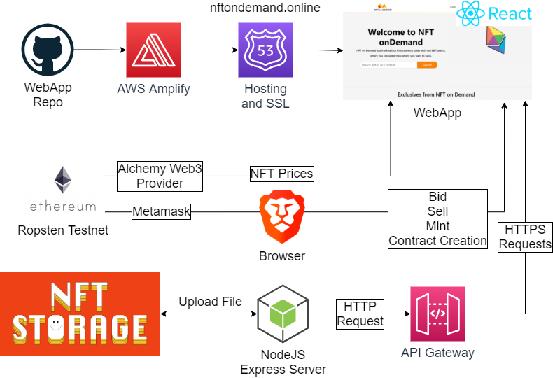
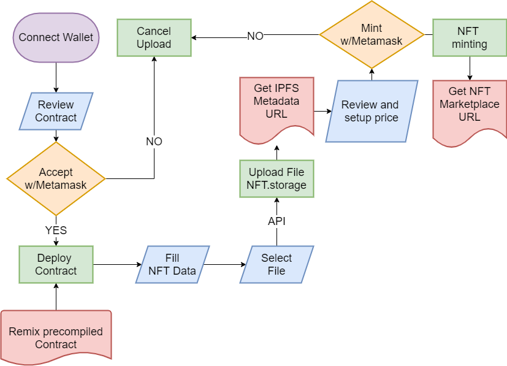

  

Socials:

https://www.instagram.com/nft_ondemand/

https://www.facebook.com/NFTonDemand-101718632295561

https://www.youtube.com/channel/UC0Tu8Wk11Bkx092eusUKnow

https://twitter.com/nft_ondemand

# NFT on Demand

 
Welcome to NFT on Demand.

### NFT on Demand is a marketplace that connects users with real NFT artists, where you can order the content you want to have.

This is our submission for the ETHOnline 2021 hackathon.

#### Click here to watch our demo video:

## To test the product follow this link (Over here Tech judges!):
<a href="https://www.nftondemand.online/" target="_blank" style="font-size:30px;">
https://www.nftondemand.online/
	
### Use Ropsten TEST net on METAMASK!!!!
</a>

# Tech:

## General Diagram:
The entire application is differentiated into two types of services where the application obtains its data to function.

## Servicios Centralizados (Cloud Services):

- AWS Amplify: CI/CD, Hosting y SSL en AWS.
- EC2: Server upload the image to NFT.Storage.
- API Gateway: Secure communication with NodeJS Server (Upload image to NFT.Storage).
- DynamoDB: user database

## Servicios Decentralizados (Web3.js y comunicacion con Smart Contracts):

- Alchemy:
	- Obtaining prices of the NFTs in real time.
- Metamask:
	- Deployment of the contract on the ETH Network (Ropsten).
	- NFT Mint.
	- Sale of NFTs through Interaction with Smart Contract.
- NFT.Storage:
 	- NFT IPFS storage and metadata.json

## Frameworks:

- NodeJS: 
	- NFT.Storage Node package: Backend to upload the image to NFT.Storage.
	- Express: Handling of server api calls.
- ReactJS: Creation of the page in frontend.
- Remix IDE: Creation and compilation of the Smart contract.

## Minting Process:

As an important part of the platform, this is the algorithm to upload an NFT to our platform, prowered by NFT.storage

## Contract:

The contract that is displayed each time you want to upload an NFT to our platform is the following.

    // SPDX-License-Identifier: MIT

    pragma solidity ^0.8.4;

    import 'https://github.com/OpenZeppelin/openzeppelin-contracts/blob/master/contracts/token/ERC721/ERC721.sol';
    import 'https://github.com/OpenZeppelin/openzeppelin-contracts/blob/master/contracts/token/ERC721/extensions/ERC721URIStorage.sol';

    contract MyToken is ERC721URIStorage {
        
        address public owner;
        address public actualAddress;
        uint256 public price;
        uint256 public actualBid;
        string public tokenURI;
        bool public flag = false;
        address constant public nftOnDemand = 0x2C1DfE385413b61FD4bd9183edE8C0b2168f0170;
        
        modifier onlyOwner{
            require(msg.sender == owner);
            _; // Close Modifier
        }
        
        constructor() ERC721('NFT', 'MyNFT') {
            owner = msg.sender;
        }
        
        function mintNFT(string memory _tokenURI, uint256 _price) public onlyOwner returns (uint256)
        {
            tokenURI = _tokenURI;
            _mint(owner, 1);
            _setTokenURI(1, tokenURI);
            price = _price;
            flag = true;
            return 1;
        }
        
        function bidUp() public payable {
            require(msg.value > actualBid);
            require(msg.value > price);
            require(flag == true);
            if(actualBid>0){
            payable(actualAddress).transfer(actualBid);  
            }
            actualAddress = msg.sender;
            actualBid = msg.value;
            price = msg.value;
        }
        
        function changePrice(uint256 _price) public onlyOwner {
            require(0 == actualBid);
            price = _price;
        }
        
        function activate() public onlyOwner{
            flag = true;
        }
        
        function finish() public onlyOwner payable {
            _transfer(owner, actualAddress, 1);
            actualBid = 0;
            flag = false;
            payable(nftOnDemand).transfer(address(this).balance/50);
            payable(owner).transfer(address(this).balance); // send the ETH to the seller
            owner = actualAddress;
        }
    }
